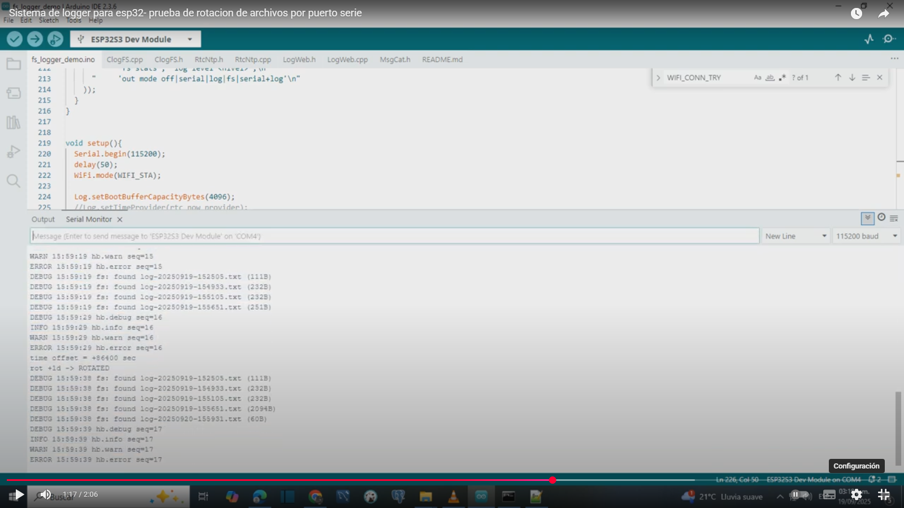
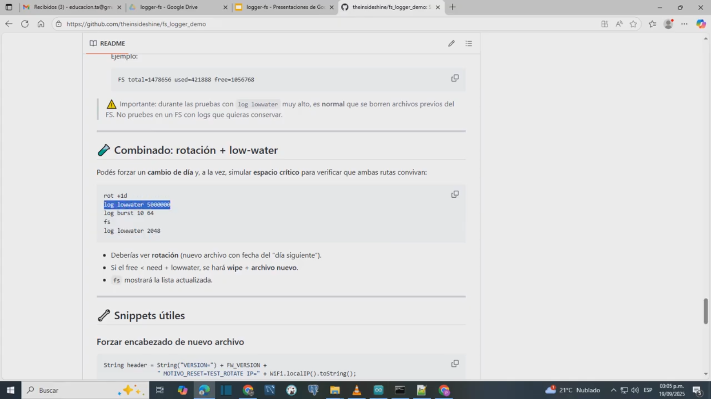
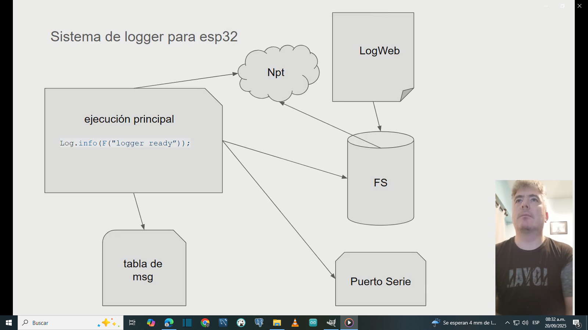

# ESP32 LittleFS Logger --- fs-logger-demo

> Sistema de log para ESP32 con **LittleFS**, **rotación diaria**,
> **reserva por low-water**, **buffer de arranque**, **niveles de
> severidad**, **modos de salida** y **web /fs** para
> ver/descargar/borrar.\
> Este README documenta los archivos `ClogFS.cpp/.h`, `LogWeb.*`,
> `RtcNtp.*`, `MsgCat.*` y el sketch `fs_logger_demo.ino`.

------------------------------------------------------------------------

## Novedades clave

-   **Severidad de logs** con prefijo textual: `TRACE`, `DEBUG`, `INFO`,
    `WARN`, `ERROR`, `CRIT`.
-   **Filtro por umbral**: `Log.setMinSeverity(ClogFS::INFO)` muestra
    `INFO+` (WARN/ERROR/CRIT).\
    Cambiable en **runtime por Serial** con `log level <nivel>`.
-   **Modos de salida (`out mode`)**: elegí si los logs van a `Serial`,
    `LittleFS`, ambos, o se desactivan.
-   **Unificación de salida**: todos los mensajes pasan por la misma
    ruta (`Log.debug/info/warn/error/...`).
-   **`listDir()` ahora respeta severidad**: usa `DEBUG` para listado y
    `WARN` para errores.

Ejemplo de salida:

    VERSION=demo-6.4 MOTIVO_RESET=WDT? IP=192.168.0.142
    INFO  10:22:12 boot: start build=demo-6.4
    INFO  10:22:12 fs: mounted (LittleFS)
    DEBUG 10:22:12 fs: found log-20250913-192654.txt (918B)
    INFO  10:22:27 RTC sync via NTP
    INFO  10:22:27 log: file created name=log-20250914-102227.txt
    INFO  10:22:27 fw=demo-6.4 ip=192.168.0.142
    DEBUG 10:22:35 hb.debug seq=1
    INFO  10:22:35 hb.info seq=1
    WARN  10:22:35 hb.warn seq=1
    ERROR 10:22:35 hb.error seq=1

------------------------------------------------------------------------

## ✨ Características

-   **Log en LittleFS** con prefijo `hh:mm:ss` cuando hay hora válida
    (RTC/NTP).
-   **Rotación diaria automática** al cambiar de día.
-   **Protección por "low-water"**: si
    `free < (bytes_a_escribir + lowwater)`, borra logs en la base y abre
    uno nuevo.
-   **Boot buffer** (por defecto 4096 B) hasta que exista un archivo
    abierto.
-   **Web `/fs`**: listar/ver/descargar/borrar
-   **CLI por Serial** para pruebas (ver comandos abajo).
-   **Inyección de tiempo** por callback (`setTimeProvider(...)`).

------------------------------------------------------------------------

## 🧩 Estructura

    /src
     ├─ ClogFS.h / ClogFS.cpp      // logger + severidad + modos salida
     ├─ LogWeb.h / LogWeb.cpp      // web /fs (listar/ver/descargar/borrar)
     ├─ RtcNtp.h / RtcNtp.cpp      // NTP + proveedor de hora (opcional)
     ├─ MsgCat.h                   // catálogo de mensajes (INFO/WARN/DEBUG/ERROR)
     └─ fs_logger_demo.ino         // demo con estados y CLI por Serial

------------------------------------------------------------------------

## ✅ Requisitos

-   **Placa**: ESP32/ESP32-S3 (Arduino core 3.x recomendado).
-   **Librerías**: `WiFi`, `LittleFS`, `FS`, `time.h` (core ESP32), y
    `WebServer` (incluida en el core).

------------------------------------------------------------------------

## ⚡ Configuración mínima

``` cpp
#include <WiFi.h>
#include <LittleFS.h>
#include "ClogFS.h"
#include "RtcNtp.h"
#include "LogWeb.h"

RtcNtp  Rtc;
ClogFS  Log;
LogWeb  logWeb(80, "/");

time_t rtc_now_provider() {
  return Rtc.isSynced() ? Rtc.now() : 0;
}

time_t rtc_now_provider_testable() {
  time_t base = Rtc.isSynced() ? Rtc.now() : time(nullptr);
  return base + g_test_time_offset; // g_test_time_offset es global en la demo
}

void setup() {
  Serial.begin(115200);
  WiFi.mode(WIFI_STA);
  LittleFS.begin(true, "/littlefs", 10, "littlefs");

  Log.setBootBufferCapacityBytes(4096);
  // --- elegí uno de estos providers ---
  // Log.setTimeProvider(rtc_now_provider);          // ← usa RTC/NTP real
  Log.setTimeProvider(rtc_now_provider_testable);   // ← usar para pruebas de rotación

  Log.setFsLowWater(2048);
  Log.setMinSeverity(ClogFS::INFO); // default: INFO+
  Log.setLevel(ClogFS::LVL_SERIAL_AND_LOG); // default: serial+log

  time_t now = time(nullptr);
  String fname  = ClogFS::makeFilename(now);
  String header = "VERSION=demo MOTIVO_RESET=BOOT IP=0.0.0.0";
  Log.openFile(fname.c_str(), header.c_str());

  Log.info(F("logger ready name=%s"), fname.c_str());
}
```

------------------------------------------------------------------------

## 🎚️ Severidad

-   Niveles: `TRACE`, `DEBUG`, `INFO`, `WARN`, `ERROR`, `CRIT`.

-   **Umbral por código**:

    ``` cpp
    Log.setMinSeverity(ClogFS::INFO); // muestra INFO/WARN/ERROR/CRIT
    ```

-   **Cambiar en runtime (Serial)**:

        log level TRACE
        log level DEBUG
        log level INFO
        log level WARN
        log level ERROR
        log level CRIT

-   **Consultar nivel actual**:

        log level

------------------------------------------------------------------------

## 🖧 Modos de salida (`out mode`)

Define **dónde** van los logs: - `off` → desactiva toda salida. -
`serial` → solo imprime en consola. - `log` / `fs` → solo guarda en
LittleFS. - `serial+log` → imprime en consola **y** guarda en archivo.

**Ejemplos (Serial):**

    out mode off
    out mode serial
    out mode log
    out mode serial+log

**Consultar modo actual:**

    out mode

**Por código:**

``` cpp
Log.setLevel(ClogFS::LVL_OFF);
Log.setLevel(ClogFS::LVL_SERIAL);
Log.setLevel(ClogFS::LVL_LOG_ONLY);
Log.setLevel(ClogFS::LVL_SERIAL_AND_LOG);
```

------------------------------------------------------------------------

## 🌐 Web `/fs` y modo configuración

    cfg on     // pausa escrituras, cierra archivo, habilita web
    cfg off    // reanuda, abre archivo nuevo y vuelca boot buffer

Cuando el ESP32 está en modo **cfg on**, se abre un servidor HTTP en el
puerto 80.\
Accediendo a `http://<IP_DEL_ESP>/fs` en el navegador se muestra:

-   **Listado de archivos de log** (`log-YYYYMMDD-HHMMSS.txt`).
-   **Acciones**: ver, descargar o borrar cada archivo.

------------------------------------------------------------------------

## 🔁 Rotación y low-water

-   **Rotación diaria**: `Log.rotateDailyIfNeeded(header)`.
-   **Low-water**: `Log.setFsLowWater(2048);`

### 🧪 Prueba de Rotación con *time provider testable*

El demo incluye un proveedor alternativo (`rtc_now_provider_testable`)
que usa un **offset de segundos** (`g_test_time_offset`).\
Esto permite simular el paso de días desde el Serial.

En `setup()`:

``` cpp
// Log.setTimeProvider(rtc_now_provider);          // ← usa RTC/NTP real
Log.setTimeProvider(rtc_now_provider_testable);   // ← usar para pruebas de rotación
```

👉 Para probar, **descomentá** `rtc_now_provider_testable` y comentá
`rtc_now_provider`.\
Cuando vuelvas a producción, hacé lo inverso.

**Comandos de prueba (Serial):**

    rot try       // intenta rotar con la fecha simulada
    rot +1d       // suma 24h al offset y chequea rotación
    rot reset     // vuelve el offset a 0 (hora real)

### Simulación de Low-water (Serial)

    fs stats
    log lowwater 5000000
    log burst 1 16
    log lowwater 2048

------------------------------------------------------------------------

## ⌨️ CLI por Serial (demo)

    cfg on / cfg off
    fs
    fs stats
    rot try | rot +1d | rot reset
    log lowwater <bytes>
    log burst N [size]
    log level [nivel]   // consulta o setea severidad
    out mode [modo]     // consulta o setea salida

------------------------------------------------------------------------

## Buenas prácticas

-   Usar solo **ASCII 7-bit** en textos.
-   Evitar `.cpp` en el sketch; incluir solo headers.
-   No usar flush manual; el logger ya gestiona boot buffer y volcados.
-   Sin RTC/NTP válido, se antepone `millis()`.

------------------------------------------------------------------------

## 📹 Videos de prueba

- **Simulación de rotación diaria**  
  [](https://www.youtube.com/watch?v=CJotrGeeTWw)

- **Simulación de low-water (espacio crítico)**  
  [](https://www.youtube.com/watch?v=xyVYG-2eL5U)

- **Demo**  
  [](https://youtu.be/VUFFeSqsDMs)


## Licencia

MIT.
